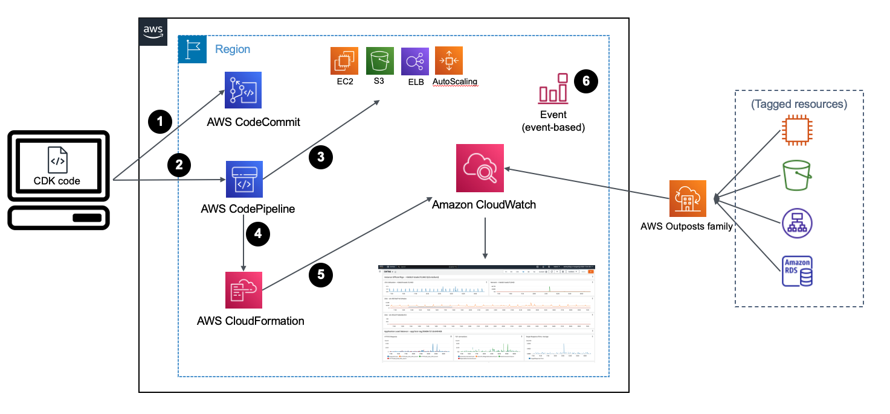

# Automated CloudWatch Dashboard

This is a project to automate the creation and the maintenance of an [Amazon CloudWatch Dashboard](https://docs.aws.amazon.com/AmazonCloudWatch/latest/monitoring/CloudWatch_Dashboards.html). At the moment the project is particularly tailored to build the Dashboard to monitor AWS Outposts and the AWS services supported in Outposts. However, it can be used also without Outposts to monitor the resources of one or more of the [Supported Services](#supported-services).

The dashboard aggregates metrics for resources of one of the supported services, either running on Outposts or in Region, together with the capacity metrics produced by Outposts and pushed under AWS/Outposts namespace. The discovery of the resources is based on a TAG, specified in the configuration file, that must be applied before running the CDK script included in this repository. 

The Amazon CloudWatch Dashboard is provisioned through a CDK Pipeline created automatically in AWS CodePipeline. 

## Supported Services

- AWS Outposts
- Amazon EC2
- Application Load Balancer
- Autoscaling Group
- Amazon S3

## Overview

The CDK stack assumes that the resources you want to add in the Dashboard (EC2 instances, S3 buckets, Application Load Balancers) **are tagged** with a specific Tag that you need to setup in the configuration file (i.e. config.yaml).
A tag is a label that you assign to an AWS resource and consists of a key and an optional value.
Based on the tag specified in a configuration file, the stack will automatically discover the resources with that Tag and adds the related metrics to the CloudWatch Dashboard. 
Together with the service specific metrics, it will create a series of widgets that you can use to monitor the capacity available and utilized in each AWS Outposts that belongs to the account where the script is running (if there is any). 



The workflow is made of the following phases: 

1.	the CDK stack creates an AWS CodeCommit repository and uploads is own code into it. The code contains a series of modules, one for each section of the CloudWatch Dashboard. A section of the Dashboard contains one or more widgets showing the metrics of a specific service.
2.	In order to maintain the CloudWatch Dashboard always up-to-date with the resources matching the Tag, it creates a pipeline in AWS CodePipeline that can create and or update dynamically the Dashboard. The pipeline runs the code in the CodeCommit repository and is made of two stages. In the first one, the build stage, it builds the dependencies needed by the CDK stack. In the second stage, the Deploy stage, it loads and runs the modules used to build the Dashboard
3.	Each module goes through a discovery phase where tagged resources of a specific service are retrieved using the Python SDK Boto3.
4.	Based on the results of the discovery phase, CDK produces a CloudFormation template containing the definition of the CloudWatch Dashboard sections. The template is submitted to CloudFormation.
5.	CloudFormation creates or, if already defined, updates the CloudWatch Dashboard.
6.	Together with the Dashboard, the CDK script contains also the definition of a CloudWatch Event that, once deployed, will trigger the pipeline each time a resource tagged with the specified tag is created or destroyed.  

## Prerequisites 

In case it is the first time that you are using AWS CDK in this account and region, you will need to:
1.	Install the AWS CDK, and its [prerequisites](https://docs.aws.amazon.com/cdk/v2/guide/getting_started.html#getting_started_prerequisites), following these [instructions](https://docs.aws.amazon.com/cdk/v2/guide/getting_started.html#getting_started_install).
2.	Go through the [AWS CDK bootstrapping process](https://docs.aws.amazon.com/cdk/v2/guide/bootstrapping.html). This is required only for the first time that we use AWS CDK in a specific [AWS environment](https://docs.aws.amazon.com/cdk/v2/guide/environments.html) (an AWS environment is a combination of an AWS account and Region). 

## Configuration 

Before deploying the stack, you need to modify the configuration file to specify the tag we use for identifying the resources to add in the Dashboard.
 
Open the file with name config.yaml with your preferred text editor and specify: 

1.	A name for the dashboard. The default name used is Automated-CloudWatch-Dashboard
2.	Replace <tag_name> placeholder following the tag_name variable
3.	Replace <tag_value> placeholder under tag_values variable

## Usage

This project is set up like a standard Python project.  The initialization
process also creates a virtualenv within this project, stored under the `.venv`
directory.  To create the virtualenv it assumes that there is a `python3`
(or `python` for Windows) executable in your path with access to the `venv`
package. If for any reason the automatic creation of the virtualenv fails,
you can create the virtualenv manually.

To manually create a virtualenv on MacOS and Linux:

```
python3 -m venv .venv
```

After the init process completes and the virtualenv is created, you can use the following
step to activate your virtualenv.

```
source .venv/bin/activate
```

If you are a Windows platform, you would activate the virtualenv like this:

```
% .venv\Scripts\activate.bat
```

Once the virtualenv is activated, you can install the required dependencies.

```
pip install -r requirements.txt
```

At this point you can now synthesize the CloudFormation template for this code.

```
cdk synth
```

Finally, you can deploy the stack with: 

```
cdk deploy
```

## Automatic update thorugh CloudWatch Events

The CDK script contains also the definition of a CloudWatch Event that, once deployed, will trigger the pipeline each time a resource tagged with the specified tag is created or destroyed. The Event rule will have the following syntax: 

```
Event rule JSON: 
        {
            "source": ["aws.tag"],
            "detail-type": ["Tag Change on Resource"],
            "detail": {
                "changed-tag-keys": ["<tag name>"],
            }
        }
```
Please note that the CloudWatch Event above catches all changes to the specific tag we configured in ***config.yaml***. Every time the tag is added or removed to a resource, the event triggers automatically the CodePipeline which in turn updates the CloudWatch Dashboard. 

The automatic update capability allows the Dashboard to be up to date without any manual intervation. This is particularly useful with AutoScaling Groups where EC2 instances are automatically launched or removed. All you need to do is to define a [Resource Tag of type EC2 instance](https://docs.aws.amazon.com/autoscaling/ec2/userguide/create-launch-template.html#create-launch-template-for-auto-scaling) in the Launch Template configuration. 

## Customization of the Dashboard

You can customize the Dashboard modifying the code of one of the supported modules located under ***automated_cloudwatch_dashboard/services*** directory. 
For each widget in the Dashboard, you can find a ***get_<widget_name>*** method in the related service module. Inside this method, widgets are created using the CDK Construct [GraphWidget](https://docs.aws.amazon.com/cdk/api/v1/python/aws_cdk.aws_cloudwatch/GraphWidget.html).

To add new Widgets in the Dashboard, you will need to call             

```
new_widget = self.get_new_widget()
widgetRows.append(cloudwatch.Row(new_widget))
```
inside ***get_widgets()*** method (there is one in each Service module).

## Dynamic update of the Dashboard

To modify the code after a succesful deployment of the Dashboard, the best-practice is to add the CodeCommit repository the Stack creates under your account in git. In [this guide](https://docs.aws.amazon.com/codecommit/latest/userguide/how-to-connect.html#how-to-connect-local) you can find detailed instructions on how to add the remote repository in git. Doing so, you can avoid to destroy and re-create the CDK stack every time you want to customize the Dashboard. After each git push CodeCommit will trigger the CodePipeline which will apply the changes to the Dashboard.  

## How to add support for new AWS Services

To add new services in the Dashboard, you need to create a module under ***automated_cloudwatch_dashboard/services*** directory. 
The python class must have defined a ***get_widgets()*** method that returns an array of [Cloudwatch Row](https://docs.aws.amazon.com/cdk/api/v2/python/aws_cdk.aws_cloudwatch/Row.html).
This resulting ***get_widgets()*** method will have the form: 

```
    def get_widgets(self):
        widgetRows = []
        
        for resource in self.resources: 

            # Header line
            markdown = f'### Widget header'
            label = cloudwatch.TextWidget(
                markdown = markdown,
                height = 1,
                width = 24
            )
            widgetRows.append(label)
            widget1 = self.get_widget1(resource)
            widget2 = self.get_widget2(resource)

            widgetRows.append(cloudwatch.Row(widget1, widget2))
        return widgetRows
```
In addition, you will need to add the module name in the ***SUPPORTED_SERVICES*** array defined in ***automated_cloudwatch_dashboard/automated_cloudwatch_dashboard_stack.py*** file.

Typically, each module goes through a discovery phase performed in the ***__init__()*** method, where resources that are added in the monitoring Dashboard are collected.
All the modules that you can find in ***automated_cloudwatch_dashboard/services*** directory use [boto3 SDK](https://aws.amazon.com/sdk-for-python/) for the discovery. 
The IAM permissions needed by CodePipeline to perform the discovery phases of the modules are defined in ***automated_cloudwatch_dashboard/pipeline_stack.py*** in the ***role_policy*** attribute. In case you define a new module which needs additional IAM permissions in the discovery phase, please remember to add the right Actions in the policy. 

## CDK-NAG

For improved security, the CDK stack is checked using [cdk-nag](https://github.com/cdklabs/cdk-nag) library using [AWS Solutions](https://github.com/cdklabs/cdk-nag/blob/main/RULES.md#awssolutions) rules.